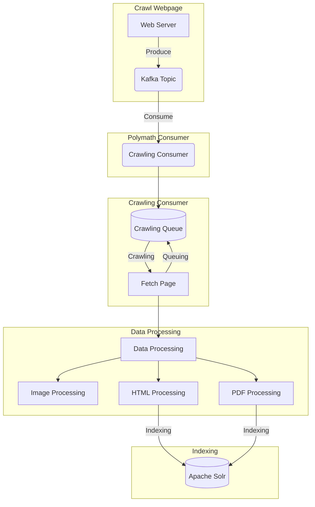

# Polymath 🕷️
> `Polymath` comes from the Greek *πολυμαθής* and means "having learned much".

Here, it is a robot that will analyze the Web pages (**Crawler**) and that will bring a mass of knowledge to the world.
Billions of sources will be analyzed to redistribute all the knowledge to the __**users**__!

## Architecture

## Feature highlights
- Support PDF
- Scoring using [Lubmminy/algorithm](https://github.com/Lubmminy/algorithm)

## License

This project is Licensed under [Apache License, Version 2.0](https://github.com/Lubmminy/Polymath/blob/master/LICENSE).
